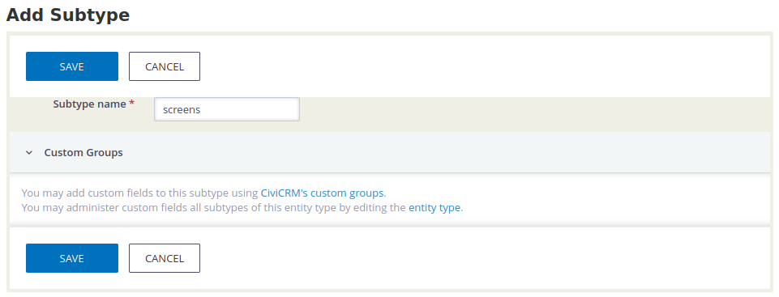

# adding entities
Before you add new entities, plan a structure for your needs. The best way to show this is with a concrete
Example: an organisation wants to manage its office equipment via CiviCRM. So before we create individual items, we need to
create a common category. These are called **ECK Entity Types**. In our example, this would be "office equipment".
For this we can in turn create **Subtypes**. We will take as an example the computer screens that are used in the organisation.
This gives us the possibility later on to give the individual "things" we create exactly the right properties.
## add entity type
After installing ECK, you will find the following entry in the administration console under **Customize Data and Screens** -
**ECK EntityTypes**. There you can create a new category with the **ADD ENTITY TYPE** button. 
Enter the system name under **Entity Type** and a name that is easy for the users to read or a translation under **Label**.

## add sub-type
Before we can continue here, we must save once so that the new type is created. From the overview
edit the new type to create a new subcategory with **ADD SUBTYPE**. Here you will also find a hint
where new fields can be created later especially for this subtype.

If you hover over **Edit** under **Edit Entity Type office equipment** at **Subtype**, 
we get a linked URL at the bottom of the screen. There, under **subtype=**, we can read the ID for this subtype (integer).
This will be needed later to create a new entity under the appropriate subtype. So let's make a note of it.

## add custom data
Next, let's create **Custom Data** for the new entity type. First, as usual, create a new set in the Admin Console
**ADD SET OF CUSTOM FIELDS**, for our example something like OfficeEquipmentData. **Used For** label name of our
type and **Any** for the whole equipment. As a field, perhaps something like NumberOf. And repeat the process
to create special fields for our screens, with something like size, connections, condition, etc.
## create new entity
***
_In a later version, new entities will be added via the ListEntities button at EntityTypes.
At the moment we use the API Explorer v4 for this._
***
In API Explorer v4 we can create a new entity with **EckOfficeEquipment - create**. For this we have to enter as
**EntityType** in this example OfficeEquipment and as **subtype** the corresponding ID (see above how to find it). **Execute**

something like this should now be issued as a response:

    {"id": 1,"title": "Dell 1234","subtype": 2 }

We now find our created entity back in the GUI under **ECK Entity Types** - office equipment - **List entities**.
If you select the corresponding name under **Title**, you will see all the details entered for the entity.